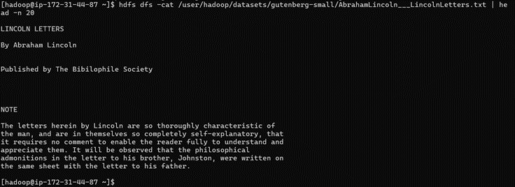
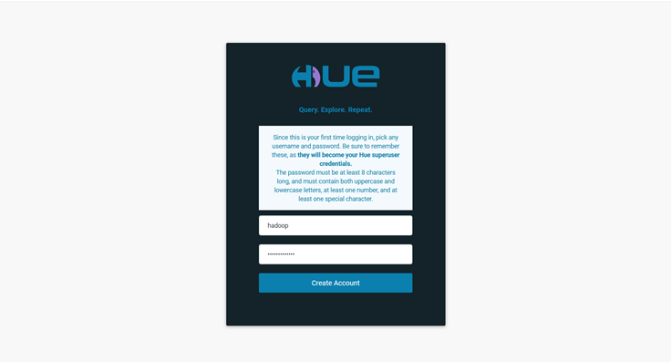
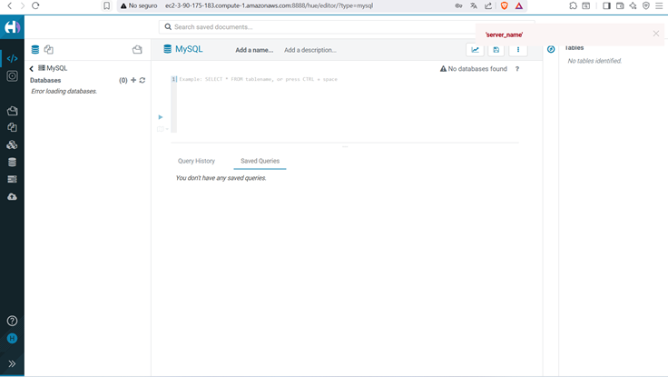
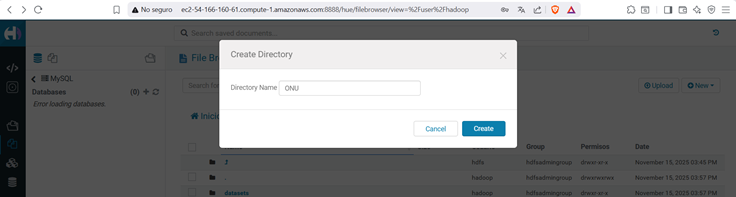
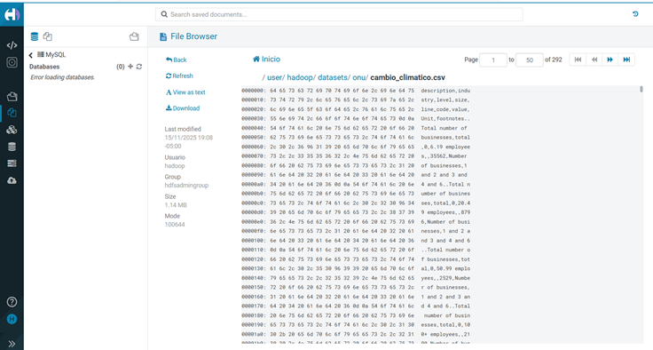
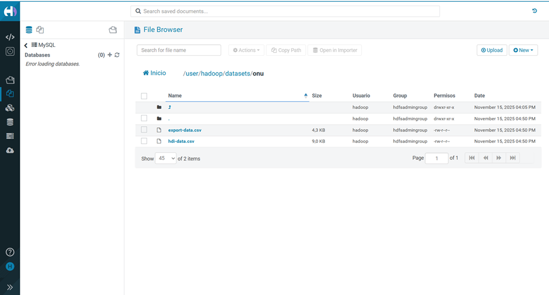

Entrada al nodo master por SSH

Clonar repo en nodo master:

Otros pasos: 

Listado de archivos copiados al directorio mis_datasets:

Probando otros comandos:

du <path>

cat <file-name>

cp <src> <dest>

mv <src> <dest>

Esto por la parte de la terminas con SSH, ahora desde HUE siguiendo los pasos tenemos: 

1.	Entrar a HUE (Login):

2.	Explorar archivos:

3.	Crear directorio

4.	Subir archivos 

5.	Ver contenido

